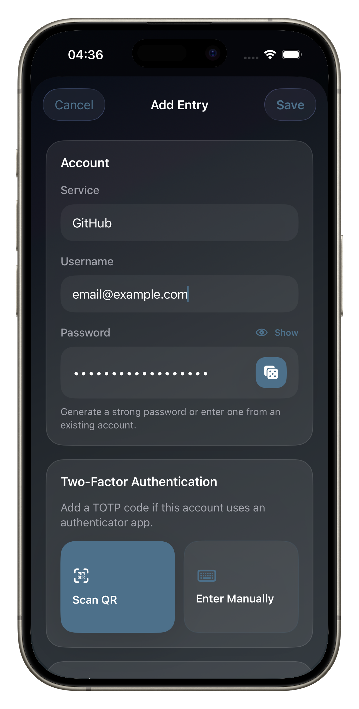
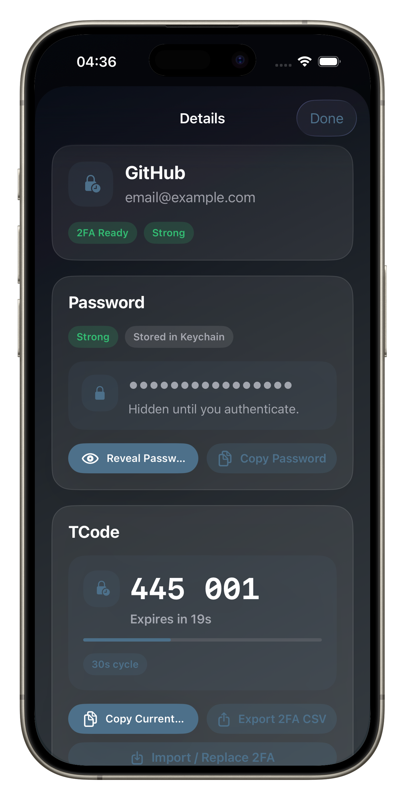
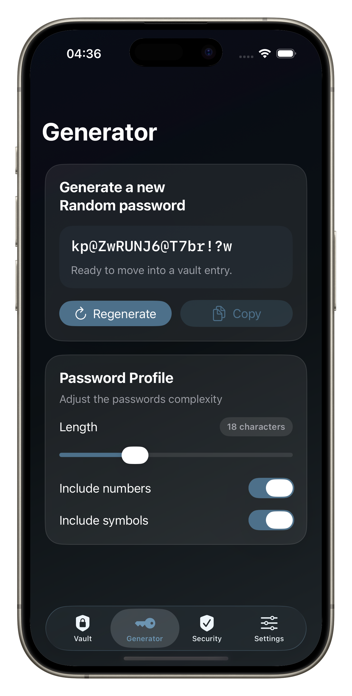

# Latch

	

Latch is a local-first iOS password manager built with SwiftUI.

It stores credentials and TOTP secrets on-device using Keychain-backed storage, with vault metadata saved locally. Latch includes password generation, QR-based 2FA setup, a security summary dashboard, and customizable lock behavior.

## Screenshots

	
	
	

## Features

- Local-first vault for account credentials.
- Password generator with adjustable length and character profile.
- Store account metadata: service, username, notes, tags, and favorites.
- TOTP support:
- Scan QR codes (`otpauth://`) on iPhone/iPad.
- Manual secret entry with configurable digits and period.
- Live rotating code display with countdown.
- Copy current code and export TOTP config as CSV.
- Biometric unlock flow with fallback device authentication.
- Auto-lock after configurable background interval.
- Security Center signals:
- Weak password detection.
- Reused password detection.
- Missing 2FA detection.
- Clipboard hygiene informational signal.
- CSV password import from common manager exports.
- Appearance and accent palette customization.

## Security And Storage Model

Latch separates secrets from metadata:

- Passwords and TOTP secrets are stored in Keychain using `kSecAttrAccessibleWhenUnlockedThisDeviceOnly`.
- Vault metadata (service name, username, tags, timestamps, references) is stored in a local JSON file in Application Support.
- App settings are stored in UserDefaults.
- There is no cloud sync in the current implementation.

## Import And Export

- Password import:
- Import CSV files from other password managers.
- The importer maps common column names (for example: `name/title/service`, `username/email`, `password/secret`).
- TOTP export:
- Export a single entry's 2FA configuration as CSV from the entry detail screen.

## Project Structure

Key folders:

- `Latch/Features`: UI flows (Vault, Generator, Security, Settings).
- `Latch/Core/Security`: Keychain, biometric auth, TOTP generation/parsing.
- `Latch/Core/Persistence`: local metadata and settings persistence.
- `Latch/Models`: app model and domain models.
- `Latch/Shared/Components`: reusable SwiftUI UI components.

## Requirements

- macOS with Xcode.
- iOS deployment target configured in project: 26.2.
- Swift version configured in project: 5.0.

## Getting Started

1. Clone the repository.
2. Open `Latch.xcodeproj` in Xcode.
3. Select the `Latch` scheme and an iOS simulator/device.
4. Build and run.

On first launch, onboarding configures biometric unlock and auto-lock defaults.

## Privacy Notes

- Latch is designed for on-device storage.
- Camera access is requested only for QR scanning of 2FA setup codes.

